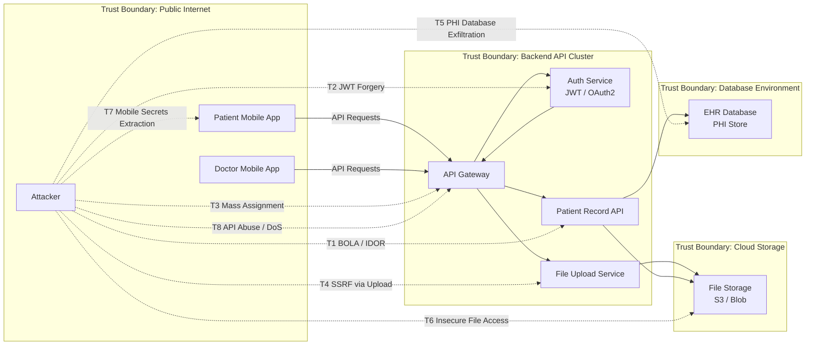
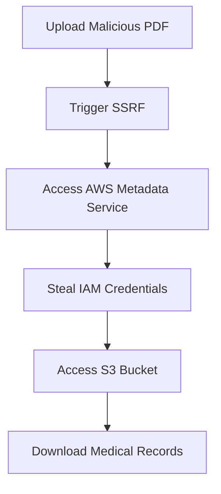
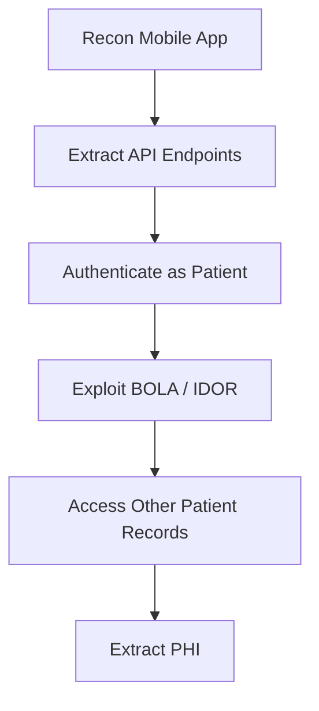

```mermaid
flowchart LR

subgraph TB1["Trust Boundary: Public Internet"]
    Patient["Patient Mobile App"]
    Doctor["Doctor Mobile App"]
    Attacker["Attacker"]
end

subgraph TB2["Trust Boundary: Backend API Cluster"]
    APIG["API Gateway"]
    AUTH["Auth Service<br/>JWT / OAuth2"]
    EHRAPI["Patient Record API"]
    UPLOAD["File Upload Service"]
end

subgraph TB3["Trust Boundary: Cloud Storage"]
    S3["File Storage<br/>S3 / Blob"]
end

subgraph TB4["Trust Boundary: Database Environment"]
    DB["EHR Database<br/>PHI Store"]
end

Patient -->|API Requests| APIG
Doctor -->|API Requests| APIG

APIG --> AUTH
AUTH --> APIG

APIG --> EHRAPI
EHRAPI --> DB

APIG --> UPLOAD
UPLOAD --> S3

EHRAPI --> S3

Attacker -. T1 BOLA / IDOR .-> EHRAPI
Attacker -. T2 JWT Forgery .-> AUTH
Attacker -. T3 Mass Assignment .-> APIG
Attacker -. T4 SSRF via Upload .-> UPLOAD
Attacker -. T5 PHI Database Exfiltration .-> DB
Attacker -. T6 Insecure File Access .-> S3
Attacker -. T7 Mobile Secrets Extraction .-> Patient
Attacker -. T8 API Abuse / DoS .-> APIG
```

```mermaid
flowchart TD

A["Upload Malicious PDF"]
B["Trigger SSRF"]
C["Access AWS Metadata Service"]
D["Steal IAM Credentials"]
E["Access S3 Bucket"]
F["Download Medical Records"]

A --> B
B --> C
C --> D
D --> E
E --> F
```

```mermaid
flowchart TD

A["Recon Mobile App"]
B["Extract API Endpoints"]
C["Authenticate as Patient"]
D["Exploit BOLA / IDOR"]
E["Access Other Patient Records"]
F["Extract PHI"]

A --> B
B --> C
C --> D
D --> E
E --> F
```
